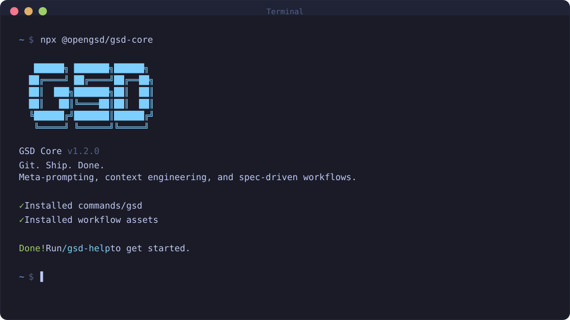

<div align="center">

# GET SHIT DONE

**English** · [Português](README.pt-BR.md) · [简体中文](README.zh-CN.md) · [日本語](README.ja-JP.md) · [한국어](README.ko-KR.md)

**A light-weight meta-prompting, context engineering, and spec-driven development system for Claude Code, OpenCode, Gemini CLI, Kilo, Codex, Copilot, Cursor, Windsurf, and more.**

**Solves context rot — the quality degradation that happens as your AI fills its context window.**

[](https://www.npmjs.com/package/get-shit-done-cc)
[](https://www.npmjs.com/package/get-shit-done-cc)
[](https://github.com/gsd-build/get-shit-done/actions/workflows/test.yml)
[](https://discord.gg/mYgfVNfA2r)
[](https://x.com/gsd_foundation)
[](https://dexscreener.com/solana/dwudwjvan7bzkw9zwlbyv6kspdlvhwzrqy6ebk8xzxkv)
[](https://github.com/gsd-build/get-shit-done)
[](LICENSE)

<br>

```bash
npx get-shit-done-cc@latest
```

**Works on Mac, Windows, and Linux.**

<br>



<br>

*"If you know clearly what you want, this WILL build it for you. No bs."*

*"I've done SpecKit, OpenSpec and Taskmaster — this has produced the best results for me."*

*"By far the most powerful addition to my Claude Code. Nothing over-engineered. Literally just gets shit done."*

<br>

**Trusted by engineers at Amazon, Google, Shopify, and Webflow.**

</div>

> **This is an opinionated fork** of [GET SHIT DONE](https://github.com/gsd-build/get-shit-done) by [TACHES](https://github.com/gsd-build). It integrates a comprehensive [SDLC methodology](FORK.md) that adds quality gates, testing discipline, issue tracking, and verification rigor as first-class defaults. See [FORK.md](FORK.md) for the full list of changes.

## Why this fork?

The upstream GSD is designed to work for everyone. This fork is designed for engineers who believe:

- **Tests are contracts, not suggestions.** The agent fixes the implementation, never the tests. If a test is wrong, the agent stops and asks.
- **Quality only moves forward.** Coverage thresholds, strict types, lint rules, and CI steps can never regress (the ratchet effect).
- **Dead code is context pollution.** Commented-out blocks, orphaned exports, and parallel implementations are flagged automatically.
- **Adversarial review at every stage.** A Devil's Advocate challenges plans before execution. An Edge Case Hunter reviews code in parallel during execution. Finder, critic, and referee agents cross-validate after execution. Three layers, three stages.
- **Every change traces back to an issue.** Branch naming, PR titles, and PR bodies link to your issue tracker automatically.
- **Spec the outcome, not the process.** Plans describe what success looks like. The executor figures out the how.
- **Playwright tests are first-class.** Screenshots are verification evidence. Manual UAT is the fallback, not the default.
- **Projects should be scaffolded right from day one.** Makefile, pre-commit hooks, preflight checks, and domain-scoped rules — all generated based on your stack.

All of these are **on by default**. Every feature is configurable — turn anything off with `/gsd-settings` — but the defaults encode an engineering philosophy where quality is automated, not aspirational.

## Getting Started with this Fork

### What's different from upstream

When you run `/gsd-new-project`, you'll be asked additional questions:

1. **Issue tracker** — Where do you track issues? (GitHub Issues, Linear, Jira)
2. **Branch naming** — What's your convention? (e.g., `prefix-NN/description`)
3. **PR conventions** — Title pattern, body requirements, CI commands
4. **Scaffolding** — Makefile, pre-commit hooks, preflight checks, domain rules

These generate a fully configured project with quality gates from day one.

### What happens during development

The enriched pipeline looks like this:

```
/gsd-new-project
  → Issue tracker, branch naming, PR conventions configured
  → Makefile, preflight.yaml, .claude/rules/ scaffolded

/gsd-discuss-phase
  → All questions asked per area (no arbitrary cutoff)
  → Architectural decisions auto-propagated to CLAUDE.md

/gsd-plan-phase
  → Outcome-focused task specs (what, not how)
  → One-sentence objectives required
  → Plan-checker validates goals
  → Devil's Advocate challenges approach, surfaces risks

/gsd-execute-phase
  → Tests are read-only (completion contracts)
  → Executor prefers Makefile targets
  → Edge Case Hunter reviews code in parallel (boundary conditions, error paths, security)
  → Playwright tests run automatically

  After execution:
  → Adversarial validation (finder + critic + referee)
  → Dead code / context pollution scan
  → Ratchet effect enforcement (quality can't regress)
  → Migration safety checks
  → Definition of Done checklist
  → Preflight checks + auto PR creation
```

### Auditing your project

Run `/gsd-sdlc-audit` to check how well your project follows the methodology:

```
$ /gsd-sdlc-audit

## SDLC Audit Report

### Tier 1: Foundation
  PASS  Git repo with main branch
  PASS  CLAUDE.md exists (278 lines)
  MISS  Makefile — no Makefile found
  PASS  Pre-commit hooks (husky)
  ...

Score: 14/20 | Current tier: Tier 2
Next: Create a Makefile with standard targets
```

Use `--fix` to auto-scaffold missing items.

---

> [!IMPORTANT]
> **Returning to GSD?**
>
> Run `/gsd-map-codebase` to re-index your codebase, then `/gsd-new-project` to rebuild GSD's planning context. Your code is fine — GSD just needs its context rebuilt. See the [CHANGELOG](CHANGELOG.md) for what's new.

---

## Why I Built This

I'm a solo developer. I don't write code — Claude Code does.

Other spec-driven tools exist, but they're all built for 50-person engineering orgs — sprint ceremonies, story points, stakeholder syncs, Jira workflows. I'm not that. I'm a creative person trying to build great things consistently.

So I built GSD. The complexity is in the system, not in your workflow. Behind the scenes: context engineering, XML prompt formatting, subagent orchestration, state management. What you see: a few commands that just work.

The system gives Claude everything it needs to do the work *and* verify it. I trust the workflow. It just does a good job.

— **TÂCHES**

---

## How It Works

The loop is six commands. Each one does exactly one thing.

### 1. Initialize

```bash
/gsd-new-project
```

Questions → research → requirements → roadmap. You approve it, then you're ready to build.

> **Already have code?** Run `/gsd-map-codebase` first. It analyzes your stack, architecture, and conventions so `/gsd-new-project` asks the right questions.

### 2. Discuss

```bash
/gsd-discuss-phase 1
```

Your roadmap has a sentence per phase. That's not enough to build it the way *you* imagine it. Discuss captures your decisions before anything gets planned: layouts, API shapes, error handling, data structures — whatever gray areas exist for this specific phase.

The output feeds directly into research and planning. Skip it, get reasonable defaults. Use it, get your vision.

### 3. Plan

```bash
/gsd-plan-phase 1
```

Research → plan → verify, in a loop until the plans pass. Each plan is small enough to execute in a fresh context window.

### 4. Execute

```bash
/gsd-execute-phase 1
```

Plans run in parallel waves. Each executor gets a fresh 200k-token context. Each task gets its own atomic commit. Walk away, come back to completed work with a clean git history.

Your main context window stays at 30–40%. The work happens in the subagents.

### 5. Verify

```bash
/gsd-verify-work 1
```

Walk through what was built. Anything broken gets a diagnosed fix plan — ready for immediate re-execution. You don't debug manually; you just run execute again.

### 6. Repeat → Ship

```bash
/gsd-ship 1
/gsd-complete-milestone
/gsd-new-milestone
```

Loop discuss → plan → execute → verify → ship until the milestone is done. Then archive, tag, and start the next one fresh.

---

## Getting Started

```bash
npx get-shit-done-cc@latest
```

The installer prompts for your runtime (Claude Code, OpenCode, Gemini CLI, Kilo, Codex, Copilot, Cursor, Windsurf, and more) and whether to install globally or locally.

```bash
claude --dangerously-skip-permissions
```

GSD is built for frictionless automation. Skip-permissions is how it's intended to run.

Install only the skills you need with `--profile=core` (six core-loop skills), `--profile=standard` (core + phase management), or the default full install. Profiles compose: `--profile=core,audit`. `--minimal` is an alias for `--profile=core`. See **[docs/USER-GUIDE.md](docs/USER-GUIDE.md)** for the full walkthrough, non-interactive install flags for all 15 runtimes, and permissions configuration. See [ADR-0011](docs/adr/0011-skill-surface-budget-module.md) for the profile model and runtime surface control.

Current release highlights are in [docs/RELEASE-v1.42.1.md](docs/RELEASE-v1.42.1.md): package legitimacy checks, safer installer migrations, runtime surface control, custom ship PR sections, reviewer defaults, fallow structural review, and quota-aware execution recovery.

---

## Commands

The main loop:

| Command | What it does |
|---------|--------------|
| `/gsd-new-project` | Questions → research → requirements → roadmap |
| `/gsd-discuss-phase [N]` | Capture implementation decisions before planning |
| `/gsd-plan-phase [N]` | Research + plan + verify |
| `/gsd-execute-phase <N>` | Execute plans in parallel waves |
| `/gsd-verify-work [N]` | Manual acceptance testing |
| `/gsd-ship [N]` | Create PR from verified phase work |
| `/gsd-progress --next` | Auto-detect and run the next step |
| `/gsd-complete-milestone` | Archive milestone and tag release |
| `/gsd-new-milestone` | Start next version |
| `/gsd:surface` | Enable/disable skill clusters at runtime without reinstall |

For ad-hoc tasks, autonomous mode, codebase analysis, forensics, and the full command surface — see **[docs/COMMANDS.md](docs/COMMANDS.md)**.

---

## Why It Works

Three things most AI-coding setups get wrong:

**1. Context bloat.** As a session grows, quality degrades. GSD keeps your main context clean by doing the heavy work in fresh subagent contexts. Researchers, planners, and executors each start fresh with exactly what they need.

**2. No shared memory.** GSD maintains structured artifacts that survive session boundaries: `PROJECT.md` (vision), `REQUIREMENTS.md` (scope), `ROADMAP.md` (where you're going), `STATE.md` (current position and decisions), `CONTEXT.md` (per-phase implementation decisions). Every new session loads these and knows exactly where things stand.

**3. No verification.** Code that "runs" isn't code that "works." GSD's verify step walks you through what was built, diagnoses failures with dedicated debug agents, and generates fix plans before you declare a phase done.

See **[docs/ARCHITECTURE.md](docs/ARCHITECTURE.md)** for how the multi-agent orchestration and context engineering work in detail.

---

## Configuration

Settings live in `.planning/config.json`. Configure during `/gsd-new-project` or update with `/gsd-settings`.

Key dials:

| Setting | What it controls |
|---------|-----------------|
| `mode` | `interactive` (confirm each step) or `yolo` (auto-approve) |
| Model profiles | `quality` / `balanced` / `budget` — controls which model each agent uses |
| `workflow.research` / `plan_check` / `verifier` | Toggle the quality agents that add tokens and time |
| `parallelization.enabled` | Run independent plans simultaneously |

Optional structural review: set `code_quality.fallow.enabled` to `true` to add a fallow pre-pass to `/gsd-code-review`. GSD writes `.planning/phases/<phase>/FALLOW.json` and surfaces a `Structural Findings (fallow)` section in `REVIEW.md`. Install with `npm install -D fallow@^2.70.0` (or system-wide via `cargo install fallow`; note that the Rust binary's JSON schema must match the documented v2.70+ contract — older versions may produce silent zero-finding output).

Package legitimacy checks are built into the research, planning, and execution path: recommended dependencies get audited, unverified packages require a human checkpoint, and failed installs stop instead of trying similarly named alternatives.

Control which Claude model each agent uses. Balance quality vs token spend.

| Profile | Planning | Execution | Verification |
|---------|----------|-----------|--------------|
| `quality` | Opus | Opus | Sonnet |
| `balanced` (default) | Opus | Sonnet | Sonnet |
| `budget` | Sonnet | Sonnet | Haiku |
| `inherit` | Inherit | Inherit | Inherit |

Switch profiles:
```
/gsd-set-profile budget
```

Use `inherit` when using non-Anthropic providers (OpenRouter, local models) or to follow the current runtime model selection (e.g. OpenCode `/model`).

Or configure via `/gsd-settings`.

Per-runtime review-model overrides live under `review.models.<cli>` (e.g. `review.models.codex`, `review.models.gemini`) and let each external review CLI pick its own model independently of the planner/executor profile.

### Workflow Agents

These spawn additional agents during planning/execution. They improve quality but add tokens and time.

| Setting | Default | What it does |
|---------|---------|--------------|
| `workflow.research` | `true` | Researches domain before planning each phase |
| `workflow.plan_check` | `true` | Verifies plans achieve phase goals before execution |
| `workflow.verifier` | `true` | Confirms must-haves were delivered after execution |
| `workflow.auto_advance` | `false` | Auto-chain discuss → plan → execute without stopping |
| `workflow.research_before_questions` | `false` | Run research before discussion questions instead of after |
| `workflow.discuss_mode` | `'discuss'` | Discussion mode: `discuss` (interview), `assumptions` (codebase-first) |
| `workflow.skip_discuss` | `false` | Skip discuss-phase in autonomous mode |
| `workflow.questions_per_area` | `'all'` | Questions per area: `'all'` (exhaust then move on) or a number (e.g., `4`, `5`) |
| `workflow.text_mode` | `false` | Text-only mode for remote sessions (no TUI menus) |
| `workflow.use_worktrees` | `true` | Toggle worktree isolation for execution |
| `workflow.build_command` | _(auto-detect)_ | Override the post-merge build gate command. Falls back to Xcode (`.xcodeproj`), Makefile, Justfile, Cargo, Go, Python, or npm; Xcode/iOS projects also run `xcodebuild test`. |
| `workflow.test_contracts` | `true` | Tests are read-only — executor fixes implementation, not tests |
| `workflow.adversarial_validation` | `true` | Three-layer adversarial review: Devil's Advocate (planning), Edge Case Hunter (execution), finder+critic+referee (verification) |
| `workflow.dead_code_scan` | `true` | Scan for dead code / context pollution during verification |
| `workflow.playwright_verification` | `true` | Use Playwright tests + screenshots as verification evidence |
| `workflow.definition_of_done` | `true` | DoD checklist at phase completion (tests, CI, docs, CLAUDE.md) |
| `workflow.preflight_on_verify` | `true` | Run preflight before PR creation |
| `workflow.spec_outcome_enforcement` | `true` | Planner specs outcomes, not step-by-step instructions |
| `workflow.update_claude_md_on_complete` | `true` | Warn if CLAUDE.md not updated after phase |
| `workflow.scaffold_preflight` | `true` | Scaffold preflight.yaml during new-project |
| `workflow.scaffold_rules` | `true` | Scaffold .claude/rules/ during new-project |
| `project.issue_tracker` | `null` | Issue tracker: `github`, `linear`, `jira`, or `null` |
| `project.issue_prefix` | `null` | Issue prefix (e.g., `AXN`) for branch/PR naming |
| `project.pr_title_template` | `null` | PR title pattern (e.g., `{PREFIX}-{ID}: {description}`) |
| `project.pr_body_requires_issue` | `true` | Require `Closes PREFIX-NN` in PR body |
| `project.ci_commands` | `null` | CI commands to suggest before PR (e.g., `["make check"]`) |

Use `/gsd-settings` to toggle these, or override per-invocation:
- `/gsd-plan-phase --skip-research`
- `/gsd-plan-phase --skip-verify`

### Execution

| Setting | Default | What it controls |
|---------|---------|------------------|
| `parallelization.enabled` | `true` | Run independent plans simultaneously |
| `planning.commit_docs` | `true` | Track `.planning/` in git |
| `hooks.context_warnings` | `true` | Show context window usage warnings |

### Agent Skills

Inject project-specific skills into subagents during execution.

| Setting | Type | What it does |
|---------|------|--------------|
| `agent_skills.<agent_type>` | `string[]` | Paths to skill directories loaded into that agent type at spawn time |

Skills are injected as `<agent_skills>` blocks in agent prompts, giving subagents access to project-specific knowledge.

### Git Branching

Control how GSD handles branches during execution.

| Setting | Options | Default | What it does |
|---------|---------|---------|--------------|
| `git.branching_strategy` | `none`, `phase`, `milestone` | `none` | Branch creation strategy |
| `git.phase_branch_template` | string | `gsd/phase-{phase}-{slug}` | Template for phase branches |
| `git.milestone_branch_template` | string | `gsd/{milestone}-{slug}` | Template for milestone branches |

**Strategies:**
- **`none`** — Commits to current branch (default GSD behavior)
- **`phase`** — Creates a branch per phase, merges at phase completion
- **`milestone`** — Creates one branch for entire milestone, merges at completion

At milestone completion, GSD offers squash merge (recommended) or merge with history.

---

## Documentation

| Doc | What's in it |
|-----|-------------|
| [User Guide](docs/USER-GUIDE.md) | End-to-end walkthrough, install options, all runtime flags, configuration reference |
| [Commands](docs/COMMANDS.md) | Every command with flags and examples |
| [Configuration](docs/CONFIGURATION.md) | Full config schema, model profiles, git branching |
| [Architecture](docs/ARCHITECTURE.md) | How the multi-agent orchestration works |
| [CLI Tools](docs/CLI-TOOLS.md) | `gsd-sdk query` and programmatic SDK dispatch seams |
| [Features](docs/FEATURES.md) | Complete feature index |
| [Changelog](CHANGELOG.md) | What changed in each release |

---

## Troubleshooting

**Commands not showing up?** Restart your runtime after install. GSD installs to `~/.claude/skills/gsd-*/` (Claude Code), `~/.codex/skills/gsd-*/` (Codex), or the equivalent for your runtime.

**Something broken?** Re-run the installer — it's idempotent:
```bash
npx get-shit-done-cc@latest
```

**Containers or Docker?** Set `CLAUDE_CONFIG_DIR` before installing to avoid tilde-expansion issues:
```bash
CLAUDE_CONFIG_DIR=/home/youruser/.claude npx get-shit-done-cc --global
```

Full troubleshooting and uninstall instructions in **[docs/USER-GUIDE.md](docs/USER-GUIDE.md#troubleshooting)**.

---

## Community

| Project | Platform |
|---------|----------|
| [gsd-opencode](https://github.com/rokicool/gsd-opencode) | Original OpenCode port |
| [Discord](https://discord.gg/mYgfVNfA2r) | Community support |

---

## Star History

<a href="https://star-history.com/#gsd-build/get-shit-done&Date">
 <picture>
   <source media="(prefers-color-scheme: dark)" srcset="https://api.star-history.com/svg?repos=gsd-build/get-shit-done&type=Date&theme=dark" />
   <source media="(prefers-color-scheme: light)" srcset="https://api.star-history.com/svg?repos=gsd-build/get-shit-done&type=Date" />
   
 </picture>
</a>

---

## License

MIT License. See [LICENSE](LICENSE) for details.

---

<div align="center">

**Claude Code is powerful. GSD makes it reliable.**

</div>
